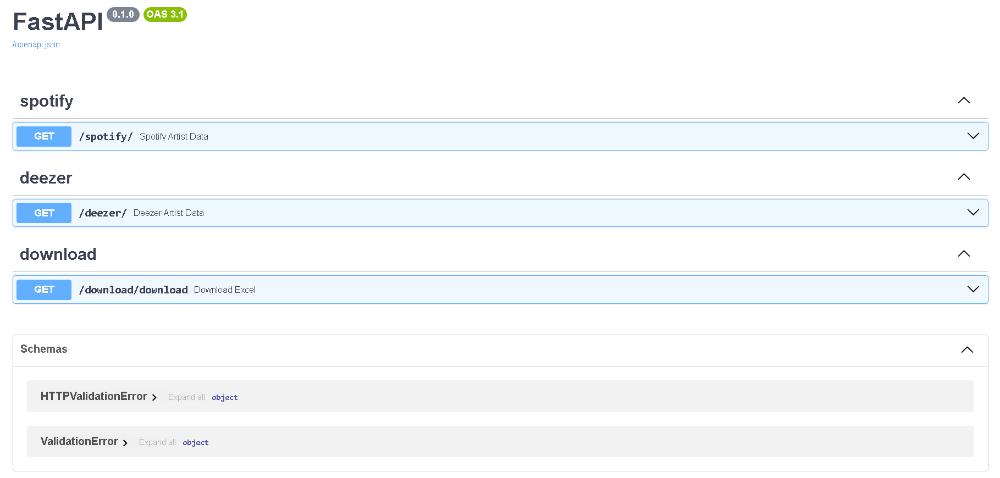

# Artist´s data

API que formata e retorna dados do seu artista favorito em várias plataformas

- [x] Consumir API do Spotify
- [x] Consumir API do Deezer
- [ ] Consumir API da AmazonMusic
- [ ] Documentar API
- [x] Criar planilhas com dados sobre artista

## Rotas

### `/Spotify` - Consome a API do Spotify e retorna os dados tratados de acordo com os parâmetros informados
